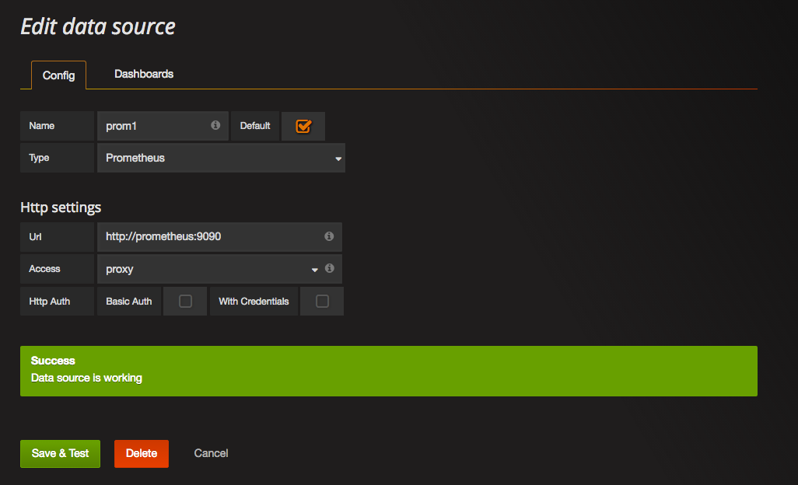

# Monitoring Workshop at [Containerdays Hamburg](http://www.containerdays.de/)

## Abstract

Container environments make it easy to deploy hundreds of microservices in today’s infrastructures. Monitoring thousands of metrics efficiently introduces new challenges to not lose insight, avoid alert fatigue and maintain a high development velocity. In this talk we’ll present an overview of important metrics including the 4 golden signals, discuss strategies to organize alerting efficiently, give insight into SoundCloud’s monitoring history and highlight a few success and failure stories.
Monitoring is the foundation of reliable products, we hope to provide practical ideas and interesting approaches to achieve that in modern container environments.

## Structure

This is a hands-on workshop. We will bring up an example application using [Docker Compose](https://www.docker.com/products/docker-compose), and then step by step add the components of a modern monitoring infrastructure using Prometheus and Grafana.

For each part, you will check out the corresponding tag of this repository. Each tag contains an example for the results of the previous parts.

# Walkthrough

## Part 0: Preparation

To participate actively in this workshop, you will need to bring a laptop.

To save time and the conference WiFi, please ensure that you have [Docker](https://docker.com) and [Docker Compose](https://docs.docker.com/compose/) installed, then run

    ./prepare.sh

from this repository. This will print your Docker version and pull a few images that we will need during the workshop.

## Part 1: An App

The [example application](example_golang/) is a Go application that simulates a web service. It opens an HTTP port with a simple API. It also generates load against this API by sending additional requests.

Start the app with

    docker-compose up -d

and find out the port it is exposed on with

    docker ps

The output should look like

    CONTAINER ID        IMAGE                     COMMAND                  CREATED             STATUS              PORTS                     NAMES
    dc167f6ee1b6        monitoringworkshop_app    "go-wrapper run"         7 seconds ago       Up 6 seconds        0.0.0.0:8080->8080/tcp   monitoringworkshop_app_1

From this you can see that the application is exposed at port 8080 of the machine running Docker. The IP depends on the variant of Docker you are running. For Docker Toolbox, run `docker-machine ip` and note the IP; in everything that follows substitute this IP for "localhost". For Docker For Mac or on native Linux, the IP is 127.0.0.1. Open <http://localhost:8080> in your browser. Follow the link to the metric page to see the metrics the application is currently exposing.

### Push vs. Pull

Prometheus follows the _pull model_ for monitoring. In this model, the monitoring server knows about the application instances and pulls metrics from them. In the _push model_, the application knows where the monitoring server is and sends metrics there.

Our example application exposes metrics about itself on the `/metrics` path. It does not care who or what requests them.

Audience discussion:

* name a push based monitoring system
* what are the trade-offs between the two models?

### Counters

Prometheus uses _counters_ as the primary metric wherever possible. Other metrics, like request rates, are derived from that at a later time.

Look for the metric `codelab_api_request_duration_seconds_count{method="GET",path="/",status="200"}` on the metric page. In a separate tab, reload the index page a few times, then reload the metrics page and watch how the request count increases.

Audience discussion:

* What are the benefits of recording counts instead of request rates? (Hint: if a request happens while noone is measuring, did the request really happen?)
* What happens if the application restarts?

### Label-value metrics model

In Prometheus, all metrics have a _name_ and 0 or more _label-value-pairs_. In the metric above, the name is `codelab_api_request_duration_seconds_count`, and the labels are `method`, `path` and `status`. Additional metrics will be added by the Prometheus server when scraping, such as the address of the instance the metric was read from.

## Part 2: Prometheus

After you have checked out the code for this part, update the setup by running

    docker-compose up -d

again.

This will start a Prometheus server. Look at [the configuration](config/prometheus.yml) to get an idea of the setup. Don't sweat over the details though – we don't want to bore you with the details of configuring Prometheus in particular.

Again, keeping in mind the `docker-machine ip` if applicable, the Prometheus web interface is now available at <http://localhost:9090>.

First, take a look at Status -> Targets. You will see that the "app" job currently has one "endpoint". This is the application container we started earlier.

Head back to the Graph page. This is a simple query interface for interactively exploring Prometheus metrics. Enter `codelab_api_request_duration_seconds_count` into the text field or select this metric from the drop-down. Run the query.

By default, the Graph page renders a tabular view of the current values for all label combinations in the query result. Click "Graph" to show the development over time.

### Filtering with labels

First, change the query to

    codelab_api_request_duration_seconds_count{method="GET"}

Then, exclude the index page by changing it to

    codelab_api_request_duration_seconds_count{method="GET",path!="/"}

How does the result list change?

### Request rates

Change the query to

    rate(codelab_api_request_duration_seconds_count[1m])

Play with the `1m` (change it to different values). Change `rate` to `irate` and play with the time again. Try the label filters from above:

    rate(codelab_api_request_duration_seconds_count{method="GET"}[1m])

The rate function deals with counter resets for you. Restart the application with

    docker-compose restart app

and observe the graphs for

    codelab_api_request_duration_seconds_count
    rate(codelab_api_request_duration_seconds_count[1m])

### Filtering by value

To only look at time series with more than 10 requests per second:

    rate(codelab_api_request_duration_seconds_count[1m]) > 10

What happens if you set the threshold higher? Lower?

### Aggregation

Now, calculate the total request rate:

    sum (rate(codelab_api_request_duration_seconds_count[1m]))

Calculate the request rate _by method_:

    sum by (method) (rate(codelab_api_request_duration_seconds_count[1m]))

### Calculation

The `codelab_api_request_duration_seconds_sum` is a counter summing up the _time_ spent responding to requests, broken out by the same dimensions as the request count. Note that in Prometheus, "counters" are not necessarily integer-valued, but they are required to be monotonically increasing. A single request that takes 43ms will increase this counter by 0.043.

We can use this to calculate the average time per request:

    rate(codelab_api_request_duration_seconds_sum[1m]) / rate(codelab_api_request_duration_seconds_count[1m])

Note how the labels are preserved and matched. What happens if you add a label restriction to one or both sides of the `/`? What happens if you add _different_ restrictions on both sides?

Try calculating the relative error rate of the example app in percent.

### Histograms

The average response time is a bad measure for a web service. [Quantiles](https://en.wikipedia.org/Quantile) provide a better view of the user experience, but they have the disadvantage of being [impossible to aggregate](http://latencytipoftheday.blogspot.de/2014/06/latencytipoftheday-you-cant-average.html). Prometheus deals with this by recording _histograms_ of observed latencies, and calculates quantiles only _after_ aggregating them.

Take a look at the query

    codelab_api_request_duration_seconds_bucket{method="GET",path="/api/bar",status="200"}

The buckets of the histogram are split up by the `le` label. The buckets are _cumulative_, so every bucket contains the number of requests that had a latency of less than or equal to the value of the label.

To calculate the median response time, run the query

    histogram_quantile(0.99,rate(codelab_api_request_duration_seconds_bucket{method="GET",path="/api/bar",status="200"}[1m]))

For the 90th percentile, change 0.5 to 0.9, for the 99th percentile change it to 0.99.

To calculate the quantile over all endpoints and methods, sum the rates but preserve the `le` label:

    histogram_quantile(0.5,sum by(le) (rate(codelab_api_request_duration_seconds_bucket[1m])))

Now try calculating the median latency across all endpoints, but separately by method.

## Part 3: cAdvisor

Not all the information about our app can be obtained from the app itself. cAdvisor collects information about the containers on a machine. Once again, check out the tag for this part and update our installation by executing

    docker-compose up -d

Also reload the Prometheus configuration:

    docker-compose kill -s HUP prometheus

Explore the metrics cAdvisor provides at <http://localhost:8081/metrics> or using the Prometheus query interface. For the purposes of this workshop, focus on the CPU utilization metrics.

* Which metric captures the CPU usage of a container?
* What does the number tell us? How do you transform it into the current utilisation?
* What is the theoretical maximum a container can use on a given machine?

cAdvisor is an example for [exporters](https://prometheus.io/docs/instrumenting/exporters/). Exporters are simple services that obtain metrics from systems that are not natively instrumented for Prometheus and expose them in the Prometheus exposition format.

## Part 4: Grafana

[Grafana](http://grafana.org) is an application to build dashboards for many data sources. One available data source is Prometheus. After you have checked out the tag for this part, start Grafana by repeating

    docker-compose up -d

once more. It will then be available at <http://localhost:3000> (adjust for `docker-machine ip` if applicable). Log in with user `admin` and password `admin`.

Add our Prometheus server as a data source: from the swirly main menu, select Data Sources, then click Add Data Source. Use the following settings:

* Name: `prom1`
* Default: checked
* Type: `Prometheus`
* Url: `http://prometheus:9090`
* Access: `Proxy`
* Basic Auth: unchecked
* With Credentials: unchecked

## Part 5: Recording rules

## Part 6: Alert rules
